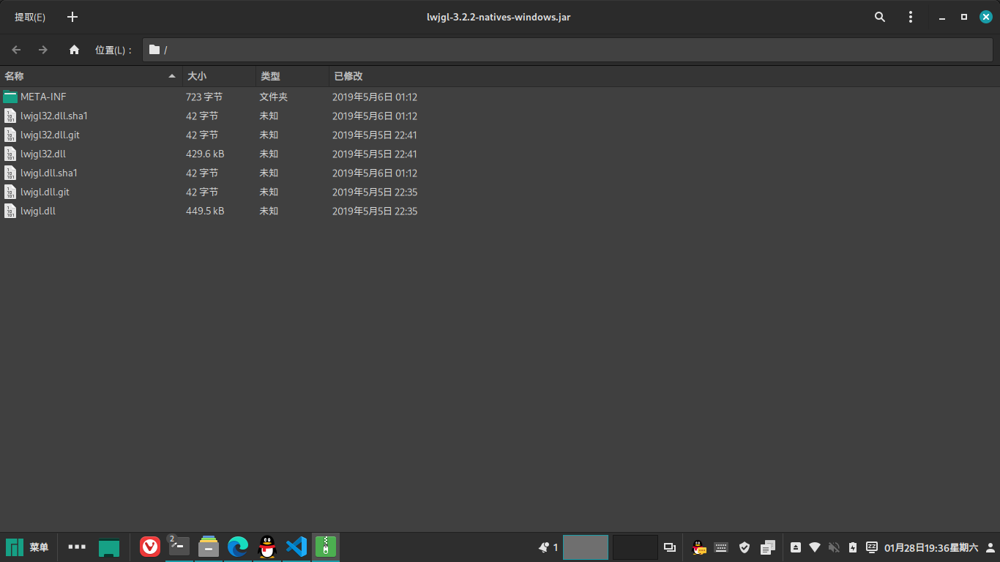

# Minecraft

要开始Minecraft的本体安装,我们首先需要了解Minecraft的目录结构  

Minecraft的版本文件夹中大致有这些主要目录:

- `libraries`: 支持库目录,存放Minecraft运行所需的jar
- `assets`: 资源文件目录,Minecraft的声音,材质,语言文件等都在assets文件夹下
- `versions`: 版本文件夹,存放各个版本

正常来说,我们下载Minecraft本体就只需要下载三部分:核心jar和json,支持库,资源文件

## Libraries(支持库)

下载版本json并打开,找到libraries键,这里写的就是所有的libraries

以下是一个libraries的例子(1.16.5):

```json
{
    "downloads": {
        "artifact": {
            "path": "com/mojang/patchy/1.3.9/patchy-1.3.9.jar",
            "sha1": "eb8bb7b66fa0e2152b1b40b3856e82f7619439ee",
            "size": 23581,
            "url": "https://libraries.minecraft.net/com/mojang/patchy/1.3.9/patchy-1.3.9.jar",
            },
        },
    "name": "com.mojang:patchy:1.3.9"
}
```

一个library有两大部分:`downloads`和`name`,对于一些支持库还会有`natives`和`rules`

如果一个支持库没有`rules`和`natives`,则说明这是一个普通支持库,且每个系统都需要它

`downloads`是支持库的下载信息,其中有`artifact`和`classifiers`,如果一个支持库中有`classifiers`,则说明这个支持库是一个**native**

`name`是该支持库的命名空间

`artifact`中的各个键意义如下:

- `path`:该支持库的路径,与游戏目录下的`libraries`路径拼接
- `sha1`:用于校验的sha1
- `size`:支持库大小,单位为B
- `url`:该支持库的下载地址

### rules

`rules`指定了哪些系统需要该支持库,哪些系统不需要该支持库,可以理解为支持库下载的规则

下面将会给出一个带有rules的支持库:

```json
{
    "downloads": {
        "artifact": {
            "path": "org/lwjgl/lwjgl-openal/3.2.2/lwjgl-openal-3.2.2.jar",
            "sha1": "2b772a102b0a11ee5f2109a5b136f4dc7c630827",
            "size": 80012,
            "url": "https://libraries.minecraft.net/org/lwjgl/lwjgl-openal/3.2.2/lwjgl-openal-3.2.2.jar",
        },
    },
    "name": "org.lwjgl:lwjgl-openal:3.2.2",
    "rules": [
        {
            "action": "allow"
        },
        {
            "action": "disallow",
            "os": {
                "name": "osx"
            }
        }
    ]

}
```

我们可以看到,rules是一个json数组,其中含有json对象

在每个json对象中,`action`表示需要或不需要,如果需要则为`allow`,不需要则为`disallow`

`os`表示针对的操作系统,如果没有则是针对所有操作系统

`os`中的name指的是针对的操作系统的名字,通常有`windows`(Windows),`osx`(MacOS)和`linux`(除MacOS外的类unix系统)

*并且读取rules时,应从上往下读取,按示例json举例,虽然第一个rule中指定所有操作系统均需要,但第二个rule中指定了osx不需要,所以本支持库在macos不适用

在支持库的下载中,应严格遵循rules,否则可能导致游戏无法启动

### native

在Minecraft的支持库中,存在一些需要被调用的dll,如OpenGL,这些支持库,我们称为`native`

native也是一个jar格式,但实际上它并不存在MainClass,只是在里面存储了需要调用的dll

下面将会给出一个示例的native json:

```json
{
    "downloads": {
        "artifact": {
            "path": "org/lwjgl/lwjgl/3.2.1/lwjgl-3.2.1.jar",
            "sha1": "2bb514e444994c6fece99a21f76e0c90438e377f",
            "size": 317748,
            "url": "https://libraries.minecraft.net/org/lwjgl/lwjgl/3.2.1/lwjgl-3.2.1.jar",
        },
        "classifiers": {
            "javadoc": {
                "path": "org/lwjgl/lwjgl/3.2.1/lwjgl-3.2.1-javadoc.jar",
                "sha1": "1f6b7050737559b775d797c0ea56612b8e373fd6",
                "size": 1287174,
                "url": "https://libraries.minecraft.net/org/lwjgl/lwjgl/3.2.1/lwjgl-3.2.1-javadoc.jar",
            },
            "natives-linux": {
                "path": "org/lwjgl/lwjgl/3.2.1/lwjgl-3.2.1-natives-linux.jar",
                "sha1": "9bdd47cd63ce102cec837a396c8ded597cb75a66",
                "size": 87484,
                "url": "https://libraries.minecraft.net/org/lwjgl/lwjgl/3.2.1/lwjgl-3.2.1-natives-linux.jar",
            },
            "natives-macos": {
                "path": "org/lwjgl/lwjgl/3.2.1/lwjgl-3.2.1-natives-macos.jar",
                "sha1": "5a4c271d150906858d475603dcb9479453c60555",
                "size": 39835,
                "url": "https://libraries.minecraft.net/org/lwjgl/lwjgl/3.2.1/lwjgl-3.2.1-natives-macos.jar",
            },
            "natives-windows": {
                "path": "org/lwjgl/lwjgl/3.2.1/lwjgl-3.2.1-natives-windows.jar",
                "sha1": "e799d06b8969db0610e68776e0eff4b6191098bd",
                "size": 255871,
                "url": "https://libraries.minecraft.net/org/lwjgl/lwjgl/3.2.1/lwjgl-3.2.1-natives-windows.jar",
            },
            "sources": {
                "path": "org/lwjgl/lwjgl/3.2.1/lwjgl-3.2.1-sources.jar",
                "sha1": "106f90ac41449004a969309488aa6e3a2f7d6731",
                "size": 255671,
                "url": "https://libraries.minecraft.net/org/lwjgl/lwjgl/3.2.1/lwjgl-3.2.1-sources.jar",
            }
        }
    },
    "name": "org.lwjgl:lwjgl:3.2.1",
    "natives": {
        "osx": "natives-macos"
    }
}
```

我们可以看到,在这个json中,downloads不仅存在`artifact`,还存在`classifiers`,`artifact`是普通支持库的下载,`classifiers`则是native的下载

除此之外,我们还可以看到`natives`,这里面包含每个系统在`classifiers`中所对应的键

在`natives`中可能有`windows`(Windows),`linux`(除MacOS外的类unix)和`osx`(MacOS)这三个键,如果`natives`中没有找到某个系统的键,则该支持库对于该系统不需要

ps:如果一个支持库json的`downloads`中既存在`artifact`又存在`classifiers`,则说明该支持库既是一个普通支持库,又有需要的native

这种情况下,`artifact`和`classifiers`(如果有对应系统的话)中的支持库都需要下载

`classifiers`中的支持库信息意义和`artifact`相同

下载native后,需要解压该jar,用压缩软件打开jar,可以看到如下信息:



我们可以看到,里面存在.dll文件,还有用来校验的.dll.sha1文件

这些dll文件需要解压出来,具体解压目录可以随意

ps:不同系统的动态链接库是不一样的,Windows为.dll,Linux为.so,Macos为.dylib

## assets

`assets`为Minecraft需要的资源文件,比如声音,语言文件,材质等

`assets`的索引在`assetIndex`文件中,该文件的下载地址在版本json中有写:

```json
"assetIndex": {
    "id": "1.16",
    "sha1": "28680197f74e5e1d55054f6a63509c8298d428f9",
    "size": 295229,
    "totalSize": 333881965,
    "url": "https://launchermeta.mojang.com/v1/packages/28680197f74e5e1d55054f6a63509c8298d428f9/1.16.json"
}
```

`assetIndex`应保存在游戏目录下的`assets`下的`indexes`目录中

`assetIndex`的信息在版本json中的`assetIndex`键中,其中每个键的意义如下:

- `id`:该assetIndex的实际下载版本,比如说,1.16.5和1.16.3的资源文件和1.16需要的相同,所以实际下载的是1.16的assetIndex
- `sha1`:该assetIndex用来校验的sha1
- `size`:该assetIndex的大小,单位为B
- `totalSize`:所有资源文件的总大小,单位为B
- `url`:该assetIndex的下载地址

assetIndex也是一个json,其中存放了所有的资源文件信息,我们截取一段举例:

```json
"objects": {"icons/icon_16x16.png": {"hash": "bdf48ef6b5d0d23bbb02e17d04865216179f510a", "size": 3665}, "icons/icon_32x32.png": {"hash": "92750c5f93c312ba9ab413d546f32190c56d6f1f", "size": 5362}}
```

我们可以看到,`objects`中为所有资源文件的信息,其中的每个键为该资源文件的真正路径与名称,但在下载中我们不需要

在每个资源文件的json中,存在两个信息,`hash`和`size`

`hash`资源文件的sha1,不仅用来校验资源文件,还用来定位资源文件

asset的下载url需要自己进行拼接:

下载url=`http://resources.download.minecraft.net(可以替换为其他api)/[资源hash前两位]/[资源hash]`

比如说本例中的`icons/icon_16x16.png`,hash为`bdf48ef6b5d0d23bbb02e17d04865216179f510a`

则该asset的下载url为:`http://resources.download.minecraft.net(可以替换为其他api)/bd/bdf48ef6b5d0d23bbb02e17d04865216179f510a`

每个asset的保存路径都应该在游戏目录下的`assets`文件夹下的`objects`文件夹,仍然拿`icons/icon_16x16.png`距离,若游戏目录在`D:\.minecraft`,则该asset的保存路径应在`D:\.minecraft\assets\objects\bd\bdf48ef6b5d0d23bbb02e17d04865216179f510a`

